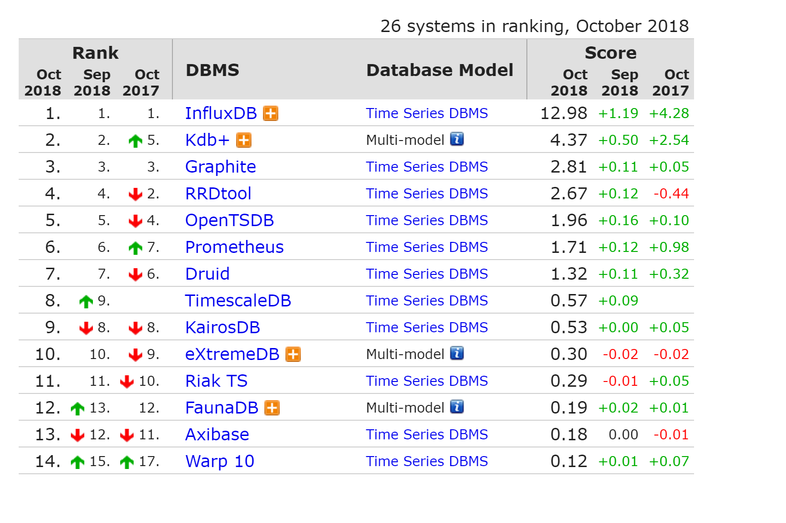
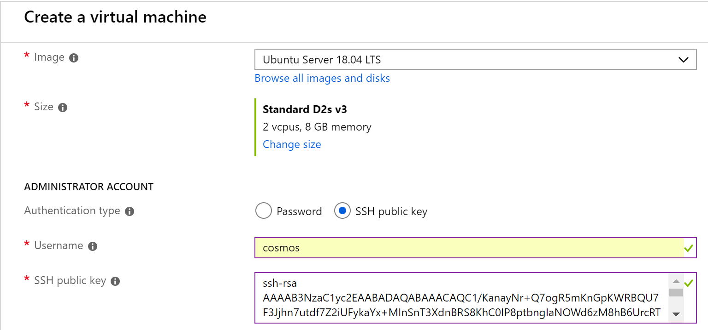

## 0. Overview ##
어플리케이션 구성시 모니터링을 위해 구축되는 3Step
- 어플리케이션 구성 요소(웹 서버, 데이터베이스, 로드 밸런서)

1. Collector: 어플리케이션에서 유의미한 데이타들을 모니터링 데몬을 통해 수집
2. Database: Elasticsearch나 InfluxDB와 같은 데이타 데이터베이스 저장
3. Dashboard: Grafana나 Kibana 와 같은 도구로 시각화

## 1. Telegraf ##
오픈소스 시스템 모니터링 에이전트.
Telegraf는 InfluxDB의 제작사, InfluxDB에서 제작한 시스템 모니터링 및 지표 수집 에이전트임. 플러그인 시스템을 기반으로 구성되어 다양한 소프트웨어, 서비스를 간단하게 추가할 수 있고, InfluxDB나 ElasticSearch와 같은 다양한 백엔드로 수집한 데이터를 전송 가능함.
* 설치가 매우 용이함 
    - 단일 바이너리로 설치 가능 하며, Go 언어로 이루어져 있어 별도의 의존성 설치 없이 다양한 플랫폼에서 실행 가능함
* plugin 을 통해서 input, output 추가 가능    
* 시스템 모니터링 가능
    - 별도의 플러그인 없이 Telegraf 만으로 CPU나 Memory 같은 사용량을 볼 수 있음
### 1.1 Install & Setup Guide 
* [Telegraf 환경구축](./telegraf/install.md)    

## 2. InfluxDB ##
시계열 데이터를 저장하고 활용하는데 특화된 형태의 DB.
아래 시계열 DB 관련 트렌드 자료를 보면 압도적으로 1위를 유지하고 있는 걸 알 수 있음.

서버, 네트워크, 스토리지와 같은 인프라 모니터링을 위한 각종 데이터. 서비스 반응을 확인하기 위한 각종 지표들 저장

* Go 언어로 되어 있어 때문에 의존관계가 없이 설치가 매우 간편함. (플랫폼에 종속적이 않음)
* 오픈소스로서 MIT 라이센스
* SQL-like 문법 사용
* Schemaless 구조
* Cluster 지원, 확장 가능
* Datasampling
    - 많은 양의 데이터를 오랜 기간 저장하는 것은 큰 부하. datasampling을 통하여 Storage 정리 가능
    - ex) 1초 주기 수집. 한달 이후에는 1초 주기 Data가 무의미하여 1분 평균으로 datasampling 
* Data Retention
    - Data 보관 조기를 설정하여 Storage 경감
* 용어정리
    - database: measurements 집합
    - mesurement: table
    - tag: indexed column
    - filed: no indexed column
* 참고: https://docs.influxdata.com/influxdb/v1.4


### 2.1 Install & Setup Guide 
* [InfluxDB 환경구축](./influxdb/install.md)

## 3. Grafana ##
시스템 모니터링 대시보드를 이쁘게 보여주는 툴로 시계열 데이터 베이스를 연동하여 시각화함
* 원하는 메트릭 지표 수집만 하면 Grafana를 통해 쉽게 시각화 가능
* 설치가 매우 용이함
* 연결 가능 Database
    - CloudWatch, Elasticserarch, Graphite, InfluxDB, OpenTSDM, Prometheus ...
* Notification
    - Email, HipChat, Pushover, webhook, Line, Slack, Telegram
* Alerting
* Dashbloard
    - https://grafana.com/dashboards
* Plugins
    - https://grafana.com/plugins

### 3.1 Install & Setup Guide 
* [Grafana 환경구축](./grafana/install.md)
* [Grafana 대쉬보드구축](../grafana/dashboard.md)

## 4. All-In-One Install Guide ##
Azure 에서 제공하는 기본 템플릿으로 해당 템플릿을 사용하면 Linux Ubuntu 14.04 LTS VM 1개에 Telegraf, InfluxDB, Grafana 가 docker container 형태로 설치됨
* Telegraf-InfluxDB-Grafana All-In-One Template :  https://github.com/Azure/azure-quickstart-templates/tree/master/101-Telegraf-InfluxDB-Grafana

### 4.1 Azure Linux VM 생성시 ssh 공개키 등록하는 방법
인증을 위해 SSH 키를 사용하는 Linux VM 을 만들려면 접속하고자 하는 머신에서 SSH 개인키와 공개키를 만들고 Destination Linux VM 에 본인의 SSH 공개키를 등록함

### ssh keypair 만들기
#### Linux OS
해당 명령을 사용하여 RSA 암호화 및 2048 비트 길이를 사용하여 SSH 키 쌍을 생성
``` bash
in@Azure:~$ ssh-keygen -t rsa -b 2048
Generating public/private rsa key pair.
Enter file in which to save the key (/home/in/.ssh/id_rsa):
Created directory '/home/in/.ssh'.
Enter passphrase (empty for no passphrase):
Enter same passphrase again:
Your identification has been saved in /home/in/.ssh/id_rsa.
Your public key has been saved in /home/in/.ssh/id_rsa.pub.
The key fingerprint is:
```

아래와 같이 개인키 id_rsa 와 공개키 id_rsa.pub 키가 생성됨
``` bash
in@Azure:~$ ls -al ~/.ssh
total 16
drwx------ 2 in in 4096 Oct 17 07:18 .
drwxr-xr-x 4 in in 4096 Oct 17 07:18 ..
-rw------- 1 in in 1679 Oct 17 07:18 id_rsa
-rw-r--r-- 1 in in  413 Oct 17 07:18 id_rsa.pub
```

일반적인 공개키의 형식은 ssh-rsa ********* 와 같음
``` bash
in@Azure:~$ cat ~/.ssh/id_rsa.pub
ssh-rsa AAAAB3NzaC1yc2EAABADAQABAAACAQC1/KanayNr+Q7ogR5mKnGpKWRBQU7F3Jjhn7utdf7Z2iUFykaYx+MInSnT3XdnBRS8KhC0IP8ptbngIaNOWd6zM8hB6UrcRTlTpwk/SuGMw1Vb40xlEFphBkVEUgBolOoANIEXriAMvlDMZsgvnMFiQ12tD/u14cxy1WNEMAftey/vX3Fgp2vEq4zHXEliY/sFZLJUJzcRUI0MOfHXAuCjg/qyqqbIuTDFyfg8k0JTtyGFEMQhbXKcuP2yGx1uw0ice62LRzr8w0mszftXyMik1PnshRXbmE2xgINYg5xo/ra3mq2imwtOKJpfdtFoMiKhJmSNHBSkK7vFTeYgg0v2cQ2+vL38lcIFX4Oh+QCzvNF/AXoDVlQtVtSqfQxRVG79Zqio5p12gHFktlfV7reCBvVIhyxc2LlYUkrq4DHzkxNY5c9OGSHXSle9YsO3F1J5ip18f6gPq4xFmo6dVoJodZm9N0YMKCkZ4k1qJDESsJBk2ujDPmQQeMjJX3FnDXYYB182ZCGQzXfzlPDC29cWVgDZEXNHuYrOLmJTmYtLZ4WkdUhLLlt5XsdoKWqlWpbegyYtGZgeZNRtOOdN6ybOPJqmYFd2qRtb4sYPniGJDOGhx4VodXAjT09omhQJpE6wlZbRWDvKC55R2d/CSPHJscEiuudb+1SG2uA/oik/WQ== username@domainname
```

#### Window OS

### ssh public key 등록
Linux VM 생성시 SSH Public Key 칸에 위에서 만든 ssh id_rsa.pub 키 내용을 복사하여 입력함


### VM에 SSH 수행
```bash
ssh cosmos@myvm.westus.cloudapp.azure.com
```

